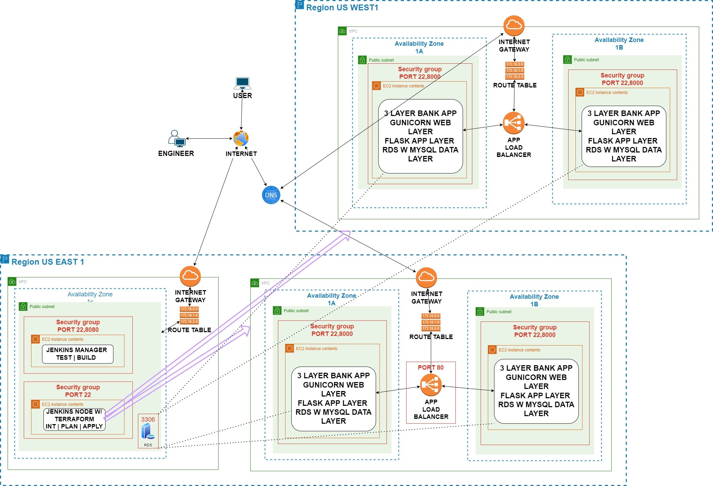

# Utlizing Terraform with Jenkins to Provision App Infrastructure (6)

### October 28, 2023
### Kevin Gonzalez

## Purpose

This deployment aims to streamline Terraform's stages using Jenkins while provisioning a banking application's infrastructure. The application now spans two regions and four Availability Zones (AZs). An application load balancer is implemented for distributing traffic, and for multi-regional support, RDS handles the database across regions.

## Deployment Steps

### 1. Jenkins Infrastructure

Terraform, an open-source Infrastructure as Code (IaC) tool, simplifies infrastructure management with its declarative configuration language. It supports multiple cloud providers and enables efficient provisioning.

In this deployment, Terraform is utilized to establish the [Jenkins infrastructure](https://github.com/kevingonzalez7997/Automate_Terraform_D6/blob/main/jenkin_and_agent/main.tf), including two instances, the manager, and the node. The [jenkins_install](https://github.com/kevingonzalez7997/Automate_Terraform_D6/blob/main/jenkin_and_agent/jenkins_install.sh)  script has been developed to install Jenkins Manager and its dependencies. The [terraform](https://github.com/kevingonzalez7997/Automate_Terraform_D6/blob/main/jenkin_and_agent/terraform.sh) script has been created to install Terraform and its dependencies. Terraform is being installed to streamline the execution of initialization, planning, and deployment tasks on the agent node.

### 2. Generate Two New Key Pairs in AWS

To launch Jenkins agents for hosting the application, SSH is used, and private keys are required. Additionally, resources are not cross-regional. Resources such as EC2 instances deployed in us-west-1 will need new keys. 

- Navigate to EC2 in the AWS console.
- Under Network & Security, find Key Pairs.
- Create a new pair and save the private key.
- Change region and repeat steps for us-west-1.

### 3. Jenkins Agents

Jenkins, an open-source automation server, is used for building, testing, and deploying code, and it can distribute workloads. In this case, the node is tasked with automating terraform steps that provision the infrastructure. 

- Create a new node.
- Specify name and location.
- Select "Launch agent via SSH" (using the previously generated key).
- The host will be the public IP of the agent instance (Agent_ec2).
- Create credentials by entering the private key directly.
- Save and check the [log](https://github.com/kevingonzalez7997/Automate_Terraform_D6/blob/main/Images/Agent_running.png) to verify agent status.

### 4. Git / GitHub

Git is a widely used distributed version control system (DVCS) for tracking changes in source code during software development. GitHub, a web-based platform, provides hosting for Git repositories and is one of the most popular platforms for version control and collaborative software development.

In this deployment, [git](https://github.com/kevingonzalez7997/Git_Cloning) is leveraged to create a dedicated [branch](https://github.com/kevingonzalez7997/Automate_Terraform_D6/blob/main/Images/MultiBranch.png) that will serve as the repository for the application's source code in the western region. Each branch is designed to host a single Terraform file, ensuring isolation and simplifying the process of making region-specific changes.

### 5. Application Infrastructure

The Jenkins node previously created will use Terraform to launch two application infrastructures across two regions. Each infrastructure will include the following [resources] in the main.tf (https://github.com/kevingonzalez7997/Automate_Terraform_D6/blob/main/initTerraform/main.tf):

- 1 Virtual Private Cloud (VPC)
- 2 Availability Zones (AZs)
- 2 Public Subnets
- 2 EC2 instances
- 1 Route Table
- Security Group with ports: 8000 and 22
- Load balancer
- Listener
- Target group 

### 6. Load Balancer Resources

1. Target Group Creation: A target group is established, serving as the destination for load balancer traffic. The target group ensures that traffic is correctly routed to the application instances. Port 8000 is utilized for communication since the application is accessed through this port.

2. EC2 Instances Attachment: The application's EC2 instances are associated with the previously created target group. This step is for directing incoming traffic to the appropriate application servers.

3. Load Balancer Configuration: A load balancer is created, with port 80 configured to accept standard HTTP traffic. This load balancer serves as the entry point for incoming requests. Once the application load balancer is established, a DNS is created by default. This DNS entry is used to access the application, ensuring that users interact with the application using its DNS name rather than an IP address.

4. Listener and Routing Rule: Lastly, a listener is configured on port 80, with the default rule set to forward traffic to the appropriate target group. This rule ensures that incoming requests are correctly distributed to the application instances.

### 7. Configure AWS Access Keys in Jenkins

To give Terraform access to the AWS account, both access and secret keys must be included. Since GitHub is the Source Code Management (SCM), this part of the Terraform file cannot be included. Instead, AWS keys will be stored securely in Jenkins.

In Jenkins server:
- Manage Jenkins
  - Credentials
    - System
      - Global credentials (unrestricted)
        - Create 2 credentials (access and secret key)
          - "Secret text"

### 8. Creating RDS Database

For the application, the free tier MySQL will be used.
- Select the free tier.
- Create and save a password.
- Allow public access.
- Name and create the database.
- A default security group will be created, and port 3306 will have to be opened. This will allow the information entered on either region application to write and read to the database.
- In order to connect them, three files will be [edited](https://github.com/kevingonzalez7997/Automate_Terraform_D6/blob/main/format.png) with the password created, database endpoint, and database name. The database.py, load_data.py, and app.py will be edited in both branches.

### 9. Create [appsetup.sh](https://github.com/kevingonzalez7997/Automate_Terraform_D6/blob/main/initTerraform/appsetup.sh)

The application is installed and deployed on an EC2 instance, which has been provisioned by Terraform through the Jenkins agent. To enable automated deployment, an 'appsetup.sh' script is created, and it is placed within the EC2 resource block in the Terraform configuration. This script automates the application deployment.

Since the application is deployed using bash commands, we can leverage the code from a previous deployment as the foundation for 'appsetup.sh'. The key distinction lies in the addition of 'pip install mysqlclient' to the script which is for the new RDS resources 

### 10. Jenkins Pipeline

GitHub is one of the most popular open-source repository platforms. The code will be pulled from a GitHub repository that has been created, which is a more practical approach.

- Create a new Jenkins item and select "Multi-branch pipeline."
- Configure Jenkins Credentials Provider as needed.
- Copy and import the Repository URL where the application source code resides.
- Use your GitHub username and the generated key from GitHub as your credentials.
- Run [Build](https://github.com/kevingonzalez7997/Automate_Terraform_D6/blob/main/Images/Jenkin_steps.png)

## Troubleshooting
If there are connection issues with EC2:
Although a default route table is created by Terraform it still has to be attached to the IGW. Be sure to include the following 
- `resource "aws_default_route_table" "route5_1" {
  default_route_table_id = aws_vpc.d5-1_vpc.default_route_table_id
   route {
    cidr_block = "0.0.0.0/0"
    gateway_id = aws_internet_gateway.gw.id
  }
}`
- when creating the app in appsetup.sh be sure not to use '_' character in the file name as it causes issues.

- when creating a resource block for the west region the ami will be different, Choose according
- The changes that were applied for the database resources need to be configured on both branches 
### Optimization

While the deployment is successful, there are opportunities for optimization and further enhancements. Here are some areas to consider for future improvements:

- **Auto Scaling Groups**: Implementing Auto Scaling Groups can enhance application availability by automatically adjusting the number of instances to match demand, ensuring high availability even during traffic spikes.
  
- **Containerization with Docker**: Consider containerizing components of your application using Docker to further automate and streamline the deployment process. Docker images can encapsulate all dependencies and simplify the deployment workflow.

- **Three-Tier Architecture**: Exploring a three-tier application architecture can enhance security and data isolation. Separating the presentation, application, and data layers can improve scalability and restrict access to sensitive data.

## Conclusion
In conclusion, this deployment successfully leveraged Terraform and Jenkins to automate infrastructure provisioning. The application now spans multiple regions, benefiting from enhanced resilience and load balancing. Jenkins streamlined our CI/CD pipeline and secured AWS key management. 
